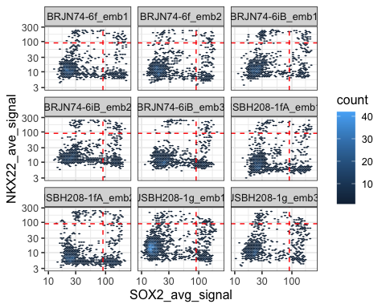

Foxa2_tracing - quantifications and plotting
================

``` r
# Load all packages
rm(list=ls())

library(tidyverse)
library(readxl)
library(pheatmap)
library(RColorBrewer)
library(lemon)
library(viridis)
```

### Load data

``` r
clean_segment <- read.csv("LinTraced_segment_plot.csv")
```

### Find thresholds

``` r
sox2_thres = 90
nkx22_thress = 90
tdt_thress = 50

ggplot(clean_segment, aes(x=SOX2_avg_signal, y=NKX22_ave_signal)) +
  geom_hex(binwidth = c(0.04, 0.04))  +
  geom_hline(yintercept=nkx22_thress,  linetype="dashed", color = "red") +
  geom_vline(xintercept=sox2_thres,  linetype="dashed", color = "red") +
  scale_x_log10()+
  scale_y_log10() +
  facet_wrap(~ embryoID) +
  theme_bw(base_size = 12)
```

<!-- -->

``` r
ggplot(clean_segment, aes(x=SOX2_avg_signal, y=NKX22_ave_signal)) +
  geom_point(size=0.2, alpha=0.5) +
  geom_hline(yintercept=nkx22_thress,  linetype="dashed", color = "red") +
  geom_vline(xintercept=sox2_thres,  linetype="dashed", color = "red") +
  scale_x_log10()+
  scale_y_log10() +
  facet_wrap(~ embryoID) +
  theme_bw(base_size = 12)
```

<!-- -->

#### tdTomato

``` r
ggplot(clean_segment, aes(x=tdTom_ave_signal, y=NKX22_ave_signal)) +
  geom_point(size=0.2, aes(color=log10(tdTom_ave_signal))) +
  scale_color_gradient2(low = "grey", mid = "white", high = "brown") +
  geom_hline(yintercept=nkx22_thress,  linetype="dashed", color = "blue") +
  geom_vline(xintercept=tdt_thress,  linetype="dashed", color = "blue") +
  scale_x_log10()+
  scale_y_log10() +
  facet_wrap(~ embryoID) +
  theme_bw(base_size = 12)
```

<!-- -->

``` r
ggplot(clean_segment, aes(x=tdTom_ave_signal, y=SOX2_avg_signal)) +
  geom_point(size=0.2, aes(color=log10(tdTom_ave_signal))) +
  scale_color_gradient2(low = "grey", mid = "white", high = "brown") +
  geom_hline(yintercept=sox2_thres,  linetype="dashed", color = "blue") +
  geom_vline(xintercept=tdt_thress,  linetype="dashed", color = "blue") +
  scale_x_log10()+
  scale_y_log10() +
  facet_wrap(~ embryoID) +
  theme_bw(base_size = 12)
```

<!-- -->

### Plot cell type based on markers

Use the position as a QC for how well the thresholds identify cell
types. Nkx2.2 has background signal in endothelial cells because it’s a
mouse antibody. Filter by positions in the next step.

``` r
full_classified <- clean_segment %>%
  mutate(celltype=if_else(SOX2_avg_signal > sox2_thres & NKX22_ave_signal > nkx22_thress, "p3",
                          if_else(NKX22_ave_signal > nkx22_thress, "V3",
                                  if_else(SOX2_avg_signal > sox2_thres,"Sox2_notp3","othercell")))) %>%
         filter(elipse_x <1000, elipse_y<1500, elipse_x>0,elipse_y >0)


ggplot(full_classified, aes(x=elipse_x, y=-elipse_y)) +
  geom_point(size=0.2,aes(color=celltype)) +
  scale_color_manual(values = c("Lightgrey","Darkgreen","DarkGrey","Magenta")) +
  facet_wrap(~ embryoID) +
  coord_fixed(ratio = 1) +
  theme_bw(base_size = 8)
```

<!-- -->

### Filter background Nkx22 cells based on position

Nkx2.2-expressing cells that are positioned more than 2 standard
deviations away from the mean (dashed red line) will be excluded.
Visualize the excluded cells below.

``` r
full_classified_filter_nkx22 <- full_classified %>%
  filter(celltype %in% c("V3","p3")) %>%
  group_by(Image) %>%
  mutate(ave_nkx22_y = mean(elipse_y, na.rm = TRUE),
         sd_nkx22_y = sd(elipse_y, na.rm = TRUE),
         dev_y = abs(elipse_y-ave_nkx22_y))

dotsize=0.2


ggplot(full_classified_filter_nkx22, aes(x=elipse_x, y=-elipse_y)) +
  geom_point(size=dotsize,aes(color=NKX22_ave_signal)) +
  scale_color_continuous(type = "viridis") +
  expand_limits(y=c(0,-1500),x=c(0,1000)) +
  geom_hline(aes(yintercept=-(ave_nkx22_y+2*sd_nkx22_y)),linetype='dashed', col = 'red') +
  facet_wrap(~ embryoID) +
  coord_fixed(ratio = 1) +
  theme_bw(base_size = 8)
```

<!-- -->

Position filter for Nkx22 cells per Image

``` r
nkx22_position_filter <- full_classified_filter_nkx22 %>%
  mutate(nkx22_y2sd_filter=ave_nkx22_y+2*sd_nkx22_y) %>% 
  select(Image,embryoID,nkx22_y2sd_filter) %>% unique()
```

Re-classify adding the positional filter

``` r
classified_filtered <- clean_segment %>%
  left_join(nkx22_position_filter, by = c("Image","embryoID")) %>% 
  mutate(celltype=if_else(SOX2_avg_signal > sox2_thres & NKX22_ave_signal > nkx22_thress & elipse_y < nkx22_y2sd_filter, "p3",
                          if_else(NKX22_ave_signal > nkx22_thress & elipse_y < nkx22_y2sd_filter, "V3",
                                  if_else(SOX2_avg_signal > sox2_thres,"Sox2_notp3","othercell")))) %>%
         filter(elipse_x <1000, elipse_y<1500, elipse_x>0,elipse_y >0)


ggplot(classified_filtered, aes(x=elipse_x, y=-elipse_y)) +
  geom_point(size=0.2,aes(color=celltype)) +
  scale_color_manual(values = c("Lightgrey","Darkgreen","DarkGrey","Magenta")) +
  facet_wrap(~ embryoID) +
  coord_fixed(ratio = 1) +
  theme_bw(base_size = 8)
```

<!-- -->

### Classify traced cells

``` r
full_classified_tdtom  <- classified_filtered %>%
           group_by(Image) %>%
           mutate(tdtom_status = if_else(tdTom_ave_signal > tdt_thress,"traced","untraced")) 
```

QC plot “traced”.

We see that they are in the expected positions.

``` r
ggplot(full_classified_tdtom, aes(x=elipse_x, y=-elipse_y)) +
  geom_point(size=0.2,aes(color=tdtom_status)) +
  facet_wrap(~ embryoID) +
  coord_fixed(ratio = 1) +
  theme_bw(base_size = 8)
```

<!-- -->

QC plot “traced” only by cell type

``` r
ggplot(full_classified_tdtom %>% filter(tdtom_status=="traced"), aes(x=elipse_x, y=-elipse_y)) +
  geom_point(size=0.2,aes(color=celltype), alpha=0.5) +
  scale_color_manual(values = c("Lightgrey","Darkgreen","orange","Magenta")) +
  facet_wrap(~ embryoID) +
  coord_fixed(ratio = 1) +
  theme_bw(base_size = 8)
```

<!-- -->

## Count traced cells

How many cells in each section is labelled as p3 or V3 and is tdTom
traced?

Use `count` to plot zero counts.

``` r
full_classified_tdtom_counts <- full_classified_tdtom %>%
  filter(tdtom_status=="traced") %>%
  mutate(celltype = factor(celltype, levels = c("p3","V3","Sox2_notp3","othercell"))) %>%
  group_by(embryoID, position, tam) %>%
  count(celltype,.drop=FALSE)


ggplot(full_classified_tdtom_counts %>% filter(celltype %in% c("p3","V3")), aes(x=tam, y=n)) +
  geom_col(aes(fill=embryoID),position=position_dodge2(0.9, preserve = "single")) +
  geom_point(aes(fill=embryoID), color="black", shape=21,position=position_dodge2(0.9, preserve = "single")) +
  facet_wrap(~ celltype) +
  ylab("Number of tdTomato+ cells per section") +
  xlab("Time of tamoxifen administration") +
  theme_bw(base_size = 12)
```

<!-- -->

``` r
sessionInfo()
```

    ## R version 4.2.1 (2022-06-23)
    ## Platform: x86_64-apple-darwin17.0 (64-bit)
    ## Running under: macOS Catalina 10.15.7
    ## 
    ## Matrix products: default
    ## BLAS:   /Library/Frameworks/R.framework/Versions/4.2/Resources/lib/libRblas.0.dylib
    ## LAPACK: /Library/Frameworks/R.framework/Versions/4.2/Resources/lib/libRlapack.dylib
    ## 
    ## locale:
    ## [1] en_GB.UTF-8/en_GB.UTF-8/en_GB.UTF-8/C/en_GB.UTF-8/en_GB.UTF-8
    ## 
    ## attached base packages:
    ## [1] stats     graphics  grDevices utils     datasets  methods   base     
    ## 
    ## other attached packages:
    ##  [1] viridis_0.6.2      viridisLite_0.4.1  lemon_0.4.5        RColorBrewer_1.1-3
    ##  [5] pheatmap_1.0.12    readxl_1.4.1       forcats_0.5.2      stringr_1.4.1     
    ##  [9] dplyr_1.0.10       purrr_0.3.4        readr_2.1.2        tidyr_1.2.1       
    ## [13] tibble_3.1.8       ggplot2_3.3.6      tidyverse_1.3.2   
    ## 
    ## loaded via a namespace (and not attached):
    ##  [1] Rcpp_1.0.9          lubridate_1.8.0     lattice_0.20-45    
    ##  [4] assertthat_0.2.1    digest_0.6.29       utf8_1.2.2         
    ##  [7] R6_2.5.1            cellranger_1.1.0    plyr_1.8.7         
    ## [10] backports_1.4.1     reprex_2.0.2        evaluate_0.16      
    ## [13] highr_0.9           httr_1.4.4          pillar_1.8.1       
    ## [16] rlang_1.0.5         googlesheets4_1.0.1 rstudioapi_0.14    
    ## [19] hexbin_1.28.2       rmarkdown_2.16      labeling_0.4.2     
    ## [22] googledrive_2.0.0   munsell_0.5.0       broom_1.0.1        
    ## [25] compiler_4.2.1      modelr_0.1.9        xfun_0.33          
    ## [28] pkgconfig_2.0.3     htmltools_0.5.3     tidyselect_1.1.2   
    ## [31] gridExtra_2.3       fansi_1.0.3         crayon_1.5.1       
    ## [34] tzdb_0.3.0          dbplyr_2.2.1        withr_2.5.0        
    ## [37] grid_4.2.1          jsonlite_1.8.0      gtable_0.3.1       
    ## [40] lifecycle_1.0.2     DBI_1.1.3           magrittr_2.0.3     
    ## [43] scales_1.2.1        cli_3.4.0           stringi_1.7.8      
    ## [46] farver_2.1.1        fs_1.5.2            xml2_1.3.3         
    ## [49] ellipsis_0.3.2      generics_0.1.3      vctrs_0.4.1        
    ## [52] tools_4.2.1         glue_1.6.2          hms_1.1.2          
    ## [55] fastmap_1.1.0       yaml_2.3.5          colorspace_2.0-3   
    ## [58] gargle_1.2.1        rvest_1.0.3         knitr_1.40         
    ## [61] haven_2.5.1
